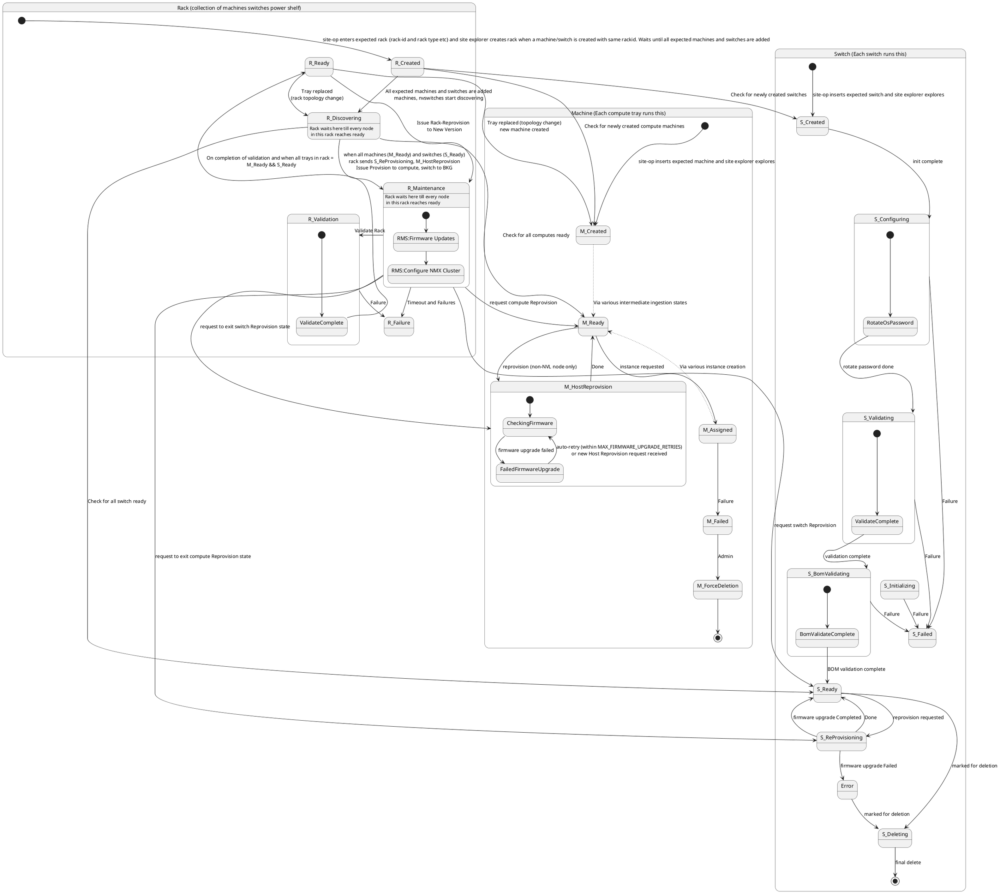

# Rack State Machine interaction with Machine, Switch

This document defines the combined state machines for **Machine** (each compute tray / managed host lifecycle), **Switch** (each switch), and **Rack** (collection of machines, switches, and power shelf). The diagram below shows all three and the transitions between the Rack state machine and the Machine/Switch state machines.

## Combined State Diagram (Machine, Switch, Rack)

---

## Switch State Machine Flow

The **Switch** state machine runs on each switch. The lifecycle runs from creation (site-op inserts expected switch, Site Explorer explores) through configuration (OS password rotation), validation, BOM validation, to Ready. From Ready a switch can be marked for deletion, or enter ReProvisioning (e.g. when the Rack requests firmware upgrade); reprovision can complete back to Ready or fail to Error and then Deleting.

### Switch State Definitions

#### Created (S_Created)

- **Entry:** Site operator inserts the expected switch; Site Explorer explores and creates the switch entity.
- **Exit:** When initialization is complete, the switch moves to **Configuring**.

#### Configuring (S_Configuring)

- **Entry:** From Created when init is complete.
- **Exit:**  
  - To **Validating** when OS password rotation is done.  
  - To **Failed** on any failure.

**Substate:** RotateOsPassword — rotates the OS password as part of initial configuration.

#### Validating (S_Validating)

- **Entry:** From Configuring when rotate password is done.
- **Exit:**  
  - To **BomValidating** when validation is complete.  
  - To **Failed** on any failure.

**Substate:** ValidateComplete — represents completion of the validation step.

#### BomValidating (S_BomValidating)

- **Entry:** From Validating when validation is complete.
- **Exit:**  
  - To **Ready** when BOM validation is complete.  
  - To **Failed** on any failure.

**Substate:** BomValidateComplete — represents completion of BOM validation.

#### Ready (S_Ready)

- **Entry:** From BomValidating when BOM validation is complete.
- **Exit:**  
  - To **Deleting** when marked for deletion.  
  - To **ReProvisioning** when reprovision is requested (e.g. by Rack for firmware upgrade).

The switch is fully operational. The Rack state machine checks for all switches in S_Ready when moving from Discovering to Maintenance and from Maintenance to Validation/Ready.

#### ReProvisioning (S_ReProvisioning)

- **Entry:** From Ready when reprovision is requested (e.g. Rack issues S_ReProvisioning for firmware upgrade).
- **Exit:**  
  - To **Ready** when firmware upgrade completes (or Done).  
  - To **Error** when firmware upgrade fails.

#### Error

- **Entry:** From ReProvisioning when firmware upgrade fails.
- **Exit:** To **Deleting** when marked for deletion.

#### Deleting (S_Deleting)

- **Entry:** From Ready when marked for deletion, or from Error when marked for deletion.
- **Exit:** To terminal **[***]** when final delete completes.

#### Failed (S_Failed)

- **Entry:** From Configuring, Validating, or BomValidating on any failure.
- **Exit:** Handled by operator/admin (recovery or remediation; not shown in the main flow).

### Switch Interaction with Rack

The Rack state machine drives or observes the Switch state machine as follows:

| Rack state     | Effect on Switch |
|----------------|------------------|
| R_Discovering  | Rack checks that all switches are S_Ready before moving to R_Maintenance. |
| R_Maintenance  | Rack requests switch reprovision (drives S_ReProvisioning); tracks when switches return to S_Ready. Rack can request exit from S_ReProvisioning. |

These cross-state dependencies are shown in the combined diagram above.

---

## Machine Interaction with Rack

The Rack state machine drives or observes the Machine (compute) state machine as follows:

| Rack state     | Effect on Machine |
|----------------|-------------------|
| R_Created      | Rack checks for newly created compute machines (M_Created) that belong to this rack. |
| R_Discovering  | Rack checks that all computes are M_Ready before moving to R_Maintenance. |
| R_Maintenance  | Rack requests compute reprovision (drives M_HostReprovision); tracks when computes return to M_Ready. Rack can request exit from M_HostReprovision. If a compute is stuck in M_HostReprovision::FailedFirmwareUpgrade, the Rack (or operator) may issue a fresh Host Reprovision request to restart the firmware upgrade flow without waiting for the auto-retry interval. |

These cross-state dependencies are shown in the combined diagram above.

---

## Rack State Machine Flow

The **Rack** state machine represents a collection of machines (compute trays), switches, and power shelf. The rack lifecycle runs in coordination with the Machine and Switch state machines: the rack tracks when its child machines and switches are created and ready, drives maintenance (firmware updates and NMX cluster configuration), and reaches Ready when all trays in the rack are ready and validation is complete.

### Rack State Definitions

#### Created (R_Created)

- **Entry:** Site operator enters the expected rack (rack-id and rack type); Site Explorer creates the rack entity when a machine or switch is added.
- **Exit:** When all expected machines and switches are added and at least one machine or NVSwitch is discovered, the rack moves to **Discovering**.

The rack exists in the system but has no discovered children yet. During this state the system checks for newly created switches (S_Created) and newly created compute machines (M_Created) that belong to this rack.

#### Discovering (R_Discovering)

- **Entry:** From Created when all expected machines and switches are added and at least one machine or NVSwitch is discovered for this rack. Also re-entered from Ready when a tray is replaced (rack topology change).
- **Exit:** When **all** machines in the rack are in M_Ready and **all** switches are in S_Ready, the rack triggers reprovision (S_ReProvisioning for switches, M_HostReprovision for computes), issues provision to compute and switch to BKG, and moves to **Maintenance**.

The rack remains in Discovering until every node in the rack reaches ready. The state machine checks for all switches ready (S_Ready) and all computes ready (M_Ready) to decide when to transition.

#### Maintenance (R_Maintenance)

- **Entry:** From Discovering when all machines and switches in the rack are ready and reprovision has been issued (transition to BKG).
- **Exit:**  
  - To **Validation** when "Validate Rack" is completed.  
  - To **Failure** on timeout or other failures.

**Substates:**

1. **RMS: Firmware Updates** — Rack-level firmware update phase.
2. **RMS: Configure NMX Cluster** — NMX cluster configuration; entered after firmware updates complete.

The rack waits in Maintenance until every node in the rack reaches ready again after reprovision. From this state the rack can request switch Reprovision (driving S_ReProvisioning) and compute Reprovision (M_HostReprovision), and tracks when switches and computes return to S_Ready and M_Ready.

- **Failure:** R_Maintenance → R_Failure on timeout or failures.

#### Validation (R_Validation)

- **Entry:** From Maintenance when "Validate Rack" is triggered.
- **Exit:**  
  - To **Ready** when validation is complete and all trays in the rack are M_Ready and S_Ready.  
  - To **Failure** on any validation failure.

**Substate:** ValidateComplete — represents completion of the validation step before the rack can transition to Ready.

#### Ready (R_Ready)

- **Entry:** From Validation when validation is complete and every tray in the rack is M_Ready and S_Ready.
- **Exit:**  
  - To **Maintenance** when a Rack-Reprovision to a new version is issued.  
  - To **Discovering** when a tray in the rack is replaced (external event), causing a rack topology change. The rack must re-discover and re-validate the new tray.

The rack is fully operational and can accept a new reprovision request to move back into Maintenance.

#### Failure (R_Failure)

- **Entry:**  
  - From Validation on failure.  
  - From Maintenance on timeout or failures.
- **Exit:** Handled by operator/admin (recovery or remediation; not shown in the main flow).

### Rack Interaction with Machine and Switch

The Rack state machine coordinates with the Machine and Switch state machines as follows:

| Rack state     | Direction / effect |
|----------------|--------------------|
| R_Created      | Checks for newly created switches → S_Created; checks for newly created compute machines → M_Created. |
| R_Discovering  | Checks for all switches ready → S_Ready; checks for all computes ready → M_Ready. |
| R_Maintenance  | Requests switch Reprovision → S_ReProvisioning; requests compute Reprovision → M_HostReprovision. Tracks when switches and computes return to S_Ready and M_Ready. Rack can request exit from switch Reprovision (S_ReProvisioning) and from compute Reprovision (M_HostReprovision). A fresh Host Reprovision request issued while the compute is in M_HostReprovision::FailedFirmwareUpgrade is accepted and restarts the firmware upgrade flow (retry counter reset). |
| R_Ready        | If a tray is replaced (external event), the rack topology changes and the rack moves back to R_Discovering to re-discover and re-validate the new tray. |

These cross-state dependencies are shown in the combined diagram above.

### Recovering from M_HostReprovision::FailedFirmwareUpgrade

A compute machine that fails its host firmware upgrade lands in the
`M_HostReprovision::FailedFirmwareUpgrade` substate. There are two ways out:

1. **Automatic retry.** While `retry_count < MAX_FIRMWARE_UPGRADE_RETRIES` and the
   configured `host_firmware_upgrade_retry_interval` has elapsed since the
   failure, the machine state handler automatically transitions back to
   `CheckingFirmwareV2` and re-attempts the upgrade.
2. **Fresh Host Reprovision request.** The Rack state machine (or an operator
   via `trigger_host_reprovisioning`) can issue a brand-new Host Reprovision
   request at any time. The new request overwrites
   `host_reprovisioning_requested` with `started_at = None`; the FailedFirmwareUpgrade
   handler detects this fresh request and restarts the upgrade flow from
   `CheckingFirmwareV2` with `retry_count` reset to `0`, mirroring the way
   `ManagedHostState::Ready` kicks off a Host Reprovision (including the
   `host-fw-update` health-report alert merge). Rack-level requests (initiator
   prefixed with `rack-`) instead enter `WaitingForRackFirmwareUpgrade`.

This guarantees the Rack can always drive a stuck compute out of
`FailedFirmwareUpgrade` without waiting for the retry backoff, which is
important during `R_Maintenance` where the Rack must converge all computes back
to `M_Ready` before progressing to `R_Validation`.

### Tray Replacement (External Event)

When a tray (compute machine) in a rack is physically replaced, the rack topology changes. This is an external event that triggers the following state machine transitions:

1. **Old machine:** The replaced machine is removed from the rack. Its Machine state machine terminates (deletion path).
2. **New machine:** Site Explorer detects the new tray and creates a new machine entity in **M_Created**. The new machine progresses through its ingestion states toward **M_Ready**.
3. **Rack:** The rack detects the topology change (a tray it expected is no longer present or a new tray has appeared) and transitions from **R_Ready** → **R_Discovering**. In R_Discovering the rack waits until the new machine reaches **M_Ready** (and all other machines and switches remain ready), then proceeds through **R_Maintenance** → **R_Validation** → **R_Ready** as in the normal flow.

This ensures that any replaced hardware is fully discovered, provisioned, and validated before the rack returns to an operational ready state.

---

**How the data is organized**

A **rack** is the top-level entity. Every **machine** (compute tray) and every **switch** belongs to exactly one rack. 

- Each rack has a unique identifier (the rack ID).
- Each machine stores the rack ID of the rack it belongs to, so the system can look up which rack a machine is part of, or list all machines in a given rack.
- Each switch also stores its rack ID in the same way, linking it back to its parent rack.
- Each switch has a flag that indicates whether a reprovision has been requested for it (for example, when the Rack state machine asks the switch to upgrade firmware). By default this flag is off.

When a site operator enters an expected rack (with a rack ID and rack type), Site Explorer creates the rack entity as soon as it discovers machines or switches that share the same rack ID. From that point the rack tracks its children through their respective state machines until the entire rack reaches a ready state.
